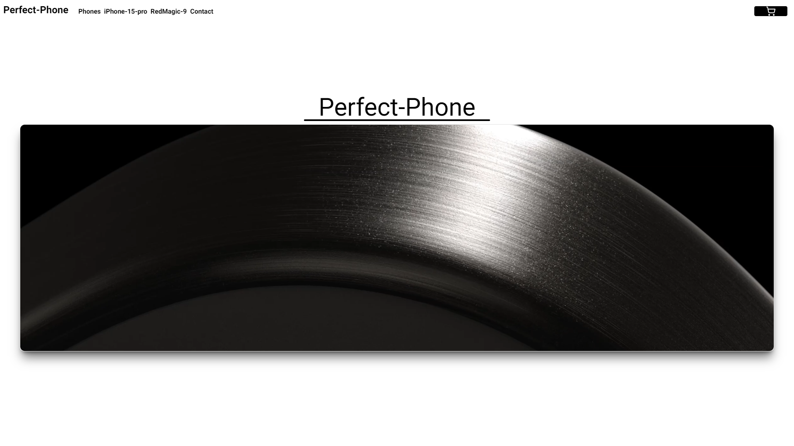
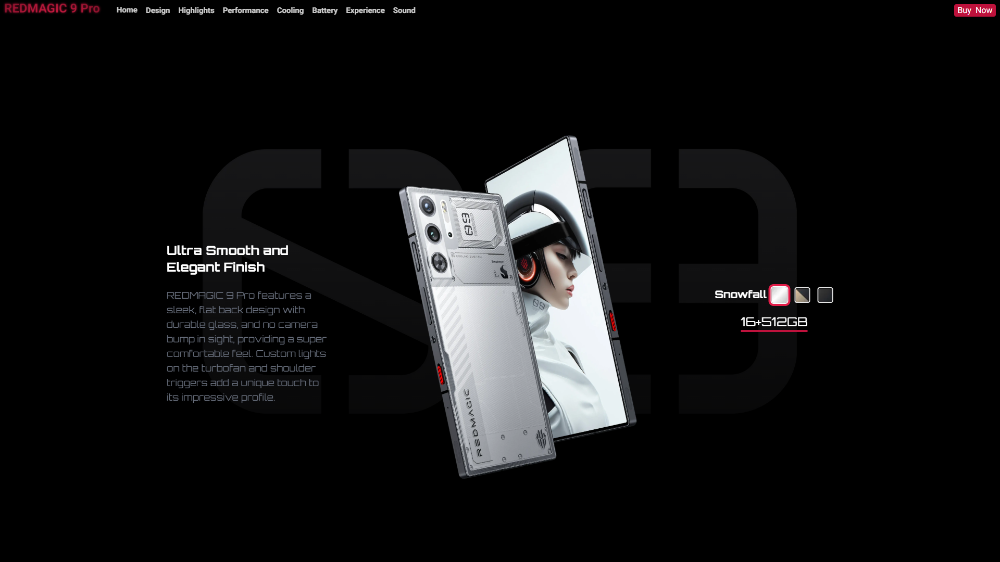
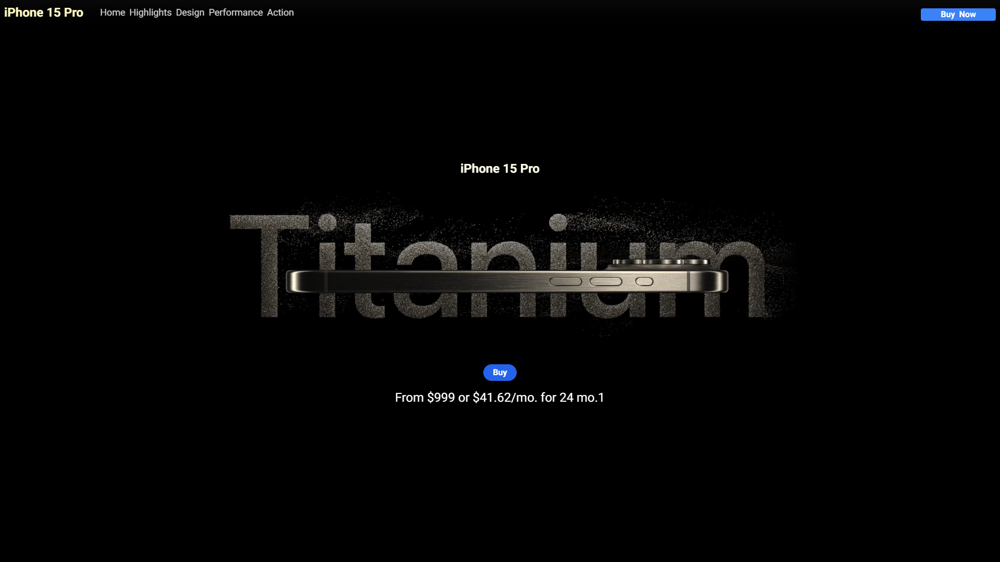

Welcome to the Phone Shop project! This e-commerce application was created to gain more experience with fetching data from APIs, handling dynamic routes,
and creating animations. Additionally, it includes a function to send user purchase details to WhatsApp, demonstrating backend data handling capabilities.

   

 Features 

       
Responsive Design
Interactive Animations
Product Filtering
Detailed Product Views
Shopping Cart
Send Purchase Details to WhatsApp
Technologies Used

 Technologies Used 

 Next.js 
 

 TypeScript 

 Tailwind CSS 

 Framer Motion 

 Shadcn 

 Lucide Icons 

